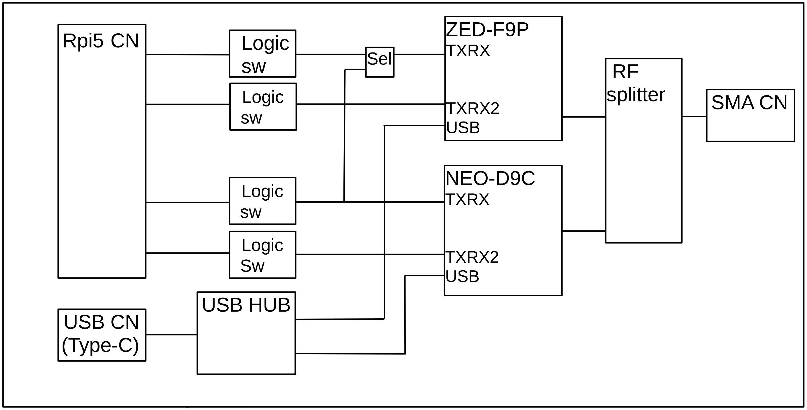

# Rpi-F9PD9C
以下の link を参照ください 
[https://www.zhtelec.com/p/Rpi-F9PD9C](https://www.zhtelec.com/p/Rpi-F9PD9C)
 
 
 
 
the multi GNSS receiver and the MICHIBIKI L6 receiver board. this board is easy to connect to Raspberry Pi 5.

## Documents
+ [Raspberry Pi5 と GNSS モジュールの初期設定](docs/README.init.md)
+ [CLASによる高精度位置情報の取得](docs/README.clas.md)
+ [NTRIPによる高精度位置情報の取得](docs/README.ntrip.md)
+ [Brochure EN](docs/Rpi-F9PD9C-1.00.docEn.pdf),    [JP](docs/Rpi-F9PD9C-1.00.docJp.pdf)
+ [Schematics](sch/Rpi-F9PD9C-1.00.sch.pdf)

## Configuration files
+ [ZED-F9P_Fw151_00_init921600.txt](conf/ZED-F9P_Fw151_00_init921600.txt)
+ [NEO-F9P_Fw101_00_init921600.txt](conf/NEO-F9P_Fw101_00_init921600.txt)

## Examples (code, setup, etc)
+ [initGnss.sh](examples/initGnss.sh) UART設定, RTLIB の install,ubxtool 921600bps対応,etc
+ [checkSerialAll.sh](examples/checkSerialAll.sh) UARTs, PPS, および PWREN の接続確認 (Raspberry Pi5 の USB と Rpi-F9PD9C の USB を接続してください)
+ [setClasAssistance.sh](examples/setClasAssistance.sh) 基板上の NEO-D9C の CLAS 補助信号を ZED-F9P に流しこみ RTK をする
+ [setNtripAssistanceFromCQ.sh](examples/setNtripAssistanceFromCQ.sh.sh) 基準局を CQ 出版社として NTRIP で RTCM3 を受信して RTK をする
