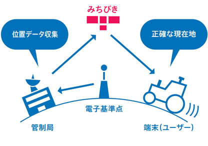
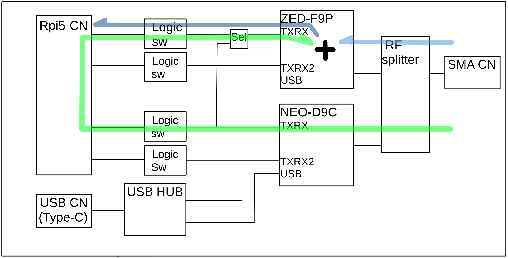
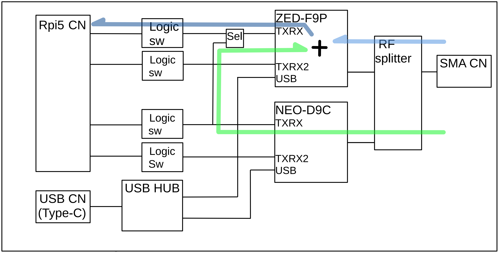

[TOP](../README.md)<br/>
# CLAS による高精度位置情報の取得



出典：[内閣府 > みちびき（準天頂衛星システム） > センチメータ級測位補強サービス](https://qzss.go.jp/overview/services/sv06_clas.html)<br/>
図中の "端末(ユーザ)" 本基板に相当します

## 1. NEO-D9C の補正情報を ZED-F9P に入力する
### 1-1 Ubuntu 上で補正情報転送


CLAS の補正情報は UART1 から受信できる. その情報を UART0 に流し込む事で ZED-F9P に入力できる. コマンドは以下の通り
```
% sudo str2str -in /dev/ttyAMA1 -out /dev/ttyAMA0
```

### 1-2 基板上で上で補正情報転送

補正情報の転送で 1-1 は Ubuntu 上で転送しているが, ソフトウェアを介さず図上の Sel (基板上の JP1) の切り換えだけで可能です. 現在 JP1 は 1-2 が接続されています. この 1-2 の配線を切り 2-3 をはんだで接続する事により, 基板上で補正データが転送できます. この際 UART0 から ZED-F9P に送られるデータは無視される事になります.
